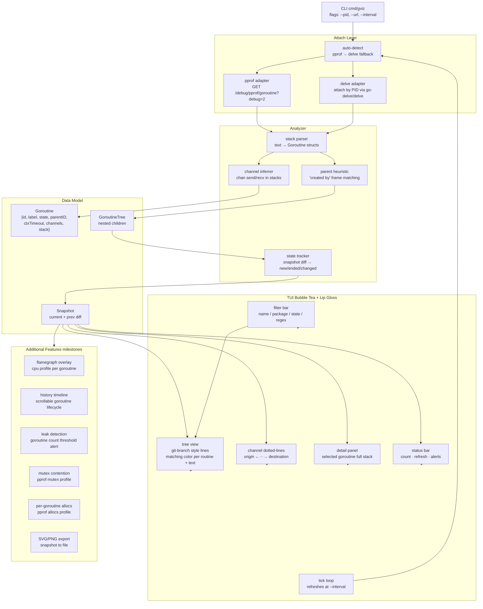
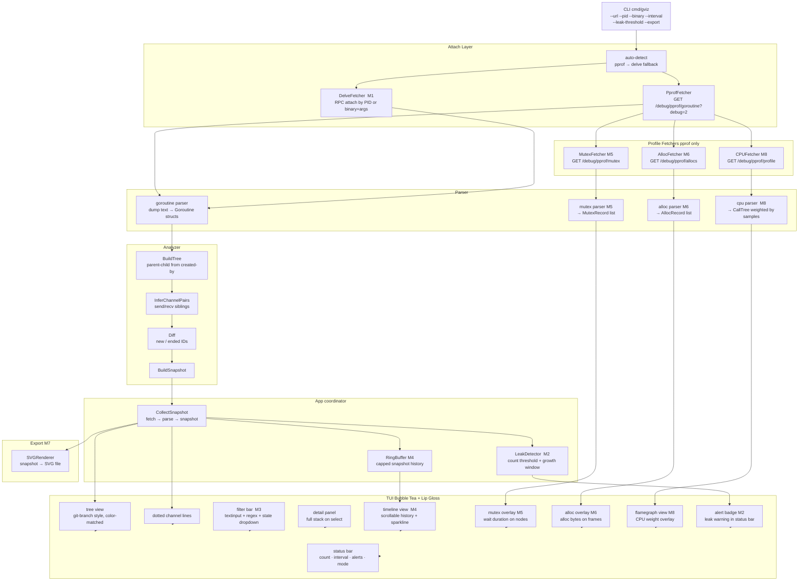
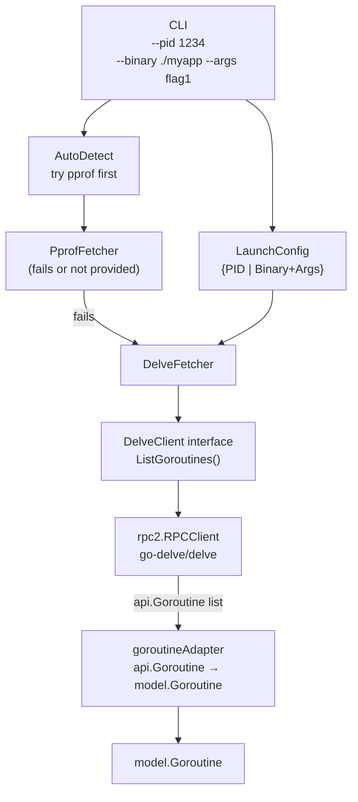
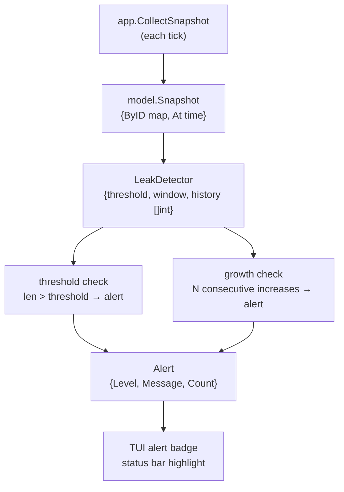
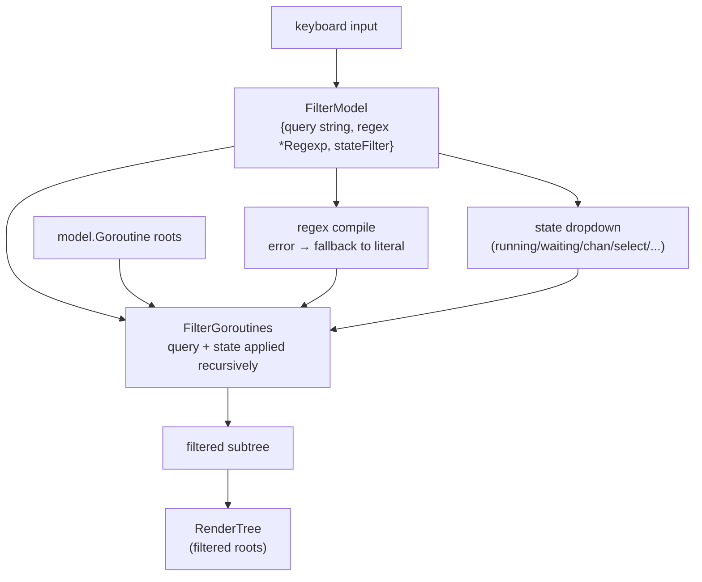
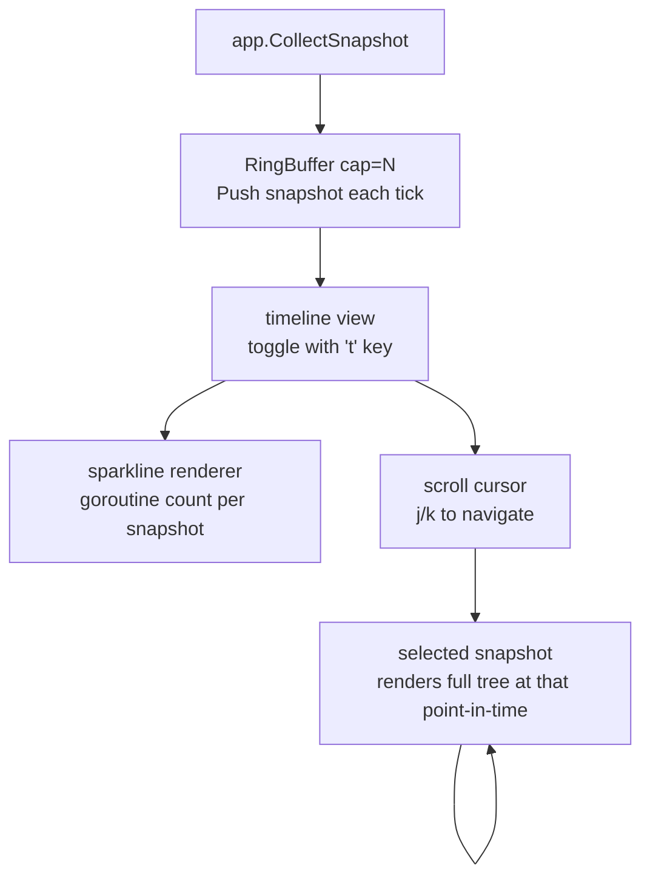
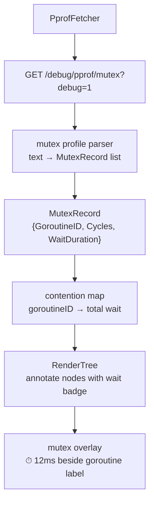
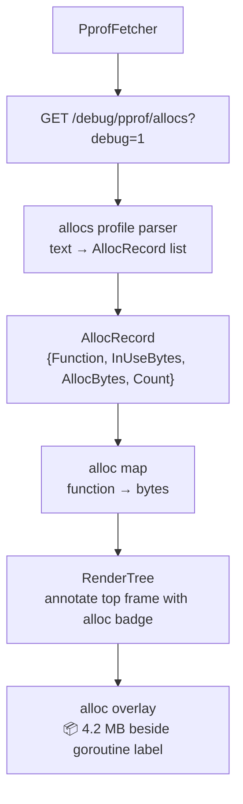
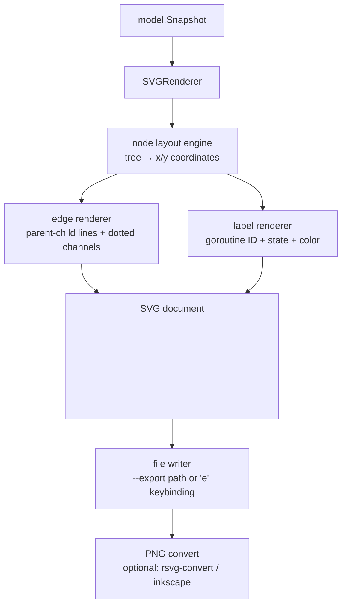
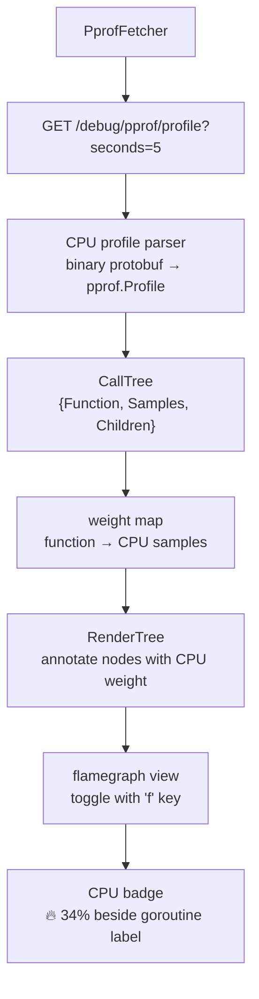

# gviz — Architecture Diagrams

All architecture diagrams for the project, in chronological order.

---

## Diagram 1 — Initial Architecture (v2, 2026-05-08)

Core system: pprof/Delve attach, stack parser, analyzer, Bubble Tea TUI.

---

## Diagram 2 — Full System with All Milestones (v9, 2026-05-08)

Extends Diagram 1 with all 8 milestones wired in.

---

## Diagram 3 — M1: Delve Attach

---

## Diagram 4 — M2: Leak Detection

---

## Diagram 5 — M3: Filter UI

---

## Diagram 6 — M4: Timeline / History

---

## Diagram 7 — M5: Mutex Contention

---

## Diagram 8 — M6: Per-Goroutine Allocs

---

## Diagram 9 — M7: SVG/PNG Export

---

## Diagram 10 — M8: Flamegraph Overlay

